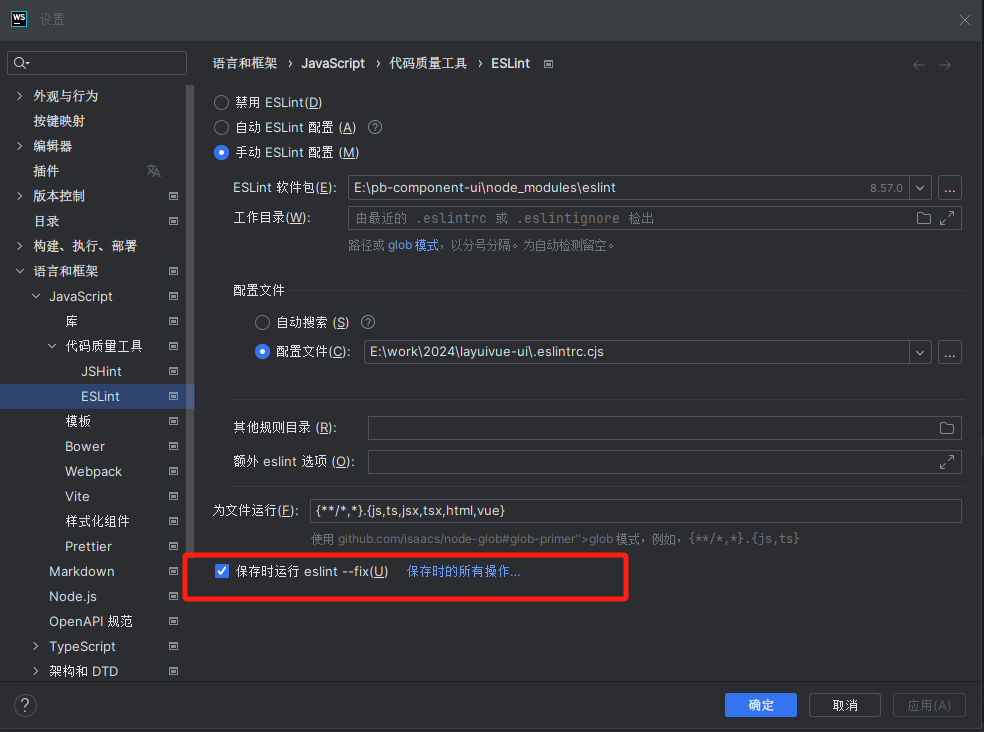
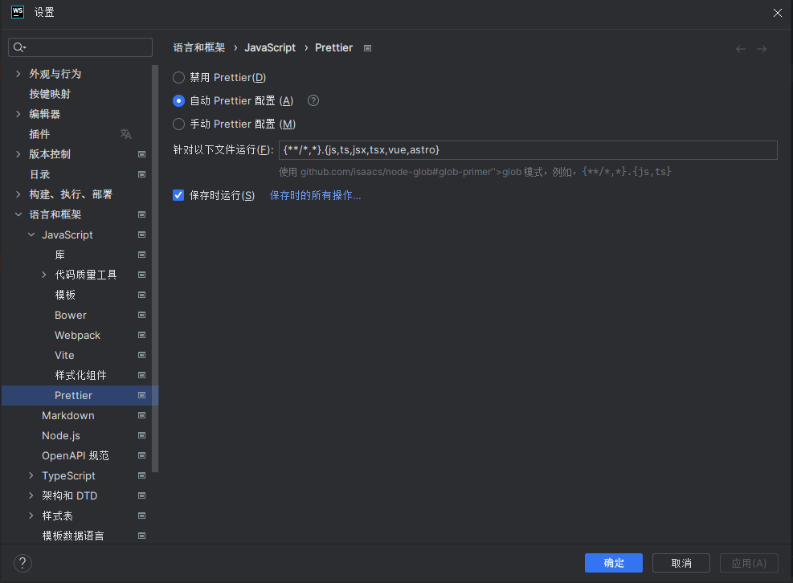

# 团队代码风格统一规范(vue)

## 一、概述

团队代码风格化，是指在团队进行开发工作时，对代码的编写树立一定规范，以提高团队协作效率和代码质量，而通常风格化的规范包括变量命名规范、代码书写格式、语法规范、注释规范等。开发中保持统一的代码风格对于提升开发效率、保障产品质量、促进团队协作以及持续交付具有长远价值。本文主要通过eslint、prettier、、husky等工具的使用来统一团队代码风格。

团队代码风格的统一优势：

- **增强代码的可读性**
  统一的代码风格能极大增强代码的可读性，使得团队成员无需适应多种不同的风格，就能快速理解任何团队成员编写的代码。一致性的代码风格减少了认知负担，帮助开发人员更快地定位和理解代码逻辑。
- **提高团队成员的协作效率**
  团队合作中，统一的代码风格意味着成员们在审查代码、合并分支或接手他人工作时能够节省时间，降低因风格不一致导致的误解和混淆。当团队成员之间切换任务时，无需花费额外时间去适应不同的代码书写习惯。
- **优化版本控制**
  在版本控制系统如Git中，由于代码风格的变更不会引起不必要的冲突，所以代码仓库会更加干净，代码审查过程也会更为高效。

## 二、工具介绍

### 1. eslint

#### 介绍

ESLint 是一个用来识别 ECMAScript 并且按照规则给出报告的代码检测工具，使用它可以避免低级错误和统一代码的风格。它拥有以下功能：查出 JavaScript 代码语法问题。根据配置的规则，标记不符合规范的代码。自动修复一些结构、风格问题。防止代码很难维护，可以帮我们检查有没有死循环，有没有定义但未使用的变量等等。
注：ESlint 常用于代码语法的检测，目前 ESlint 的格式化器正不被其开发团队建议。
ESLint官方文档：<https://eslint.cn/>

#### 使用方法

a、安装依赖

```npm
pnpm install -D eslint @eslint/create-config
```

下面的安装的依赖是为了解决eslint与priter的冲突问题

```npm
pnpm install -D eslint-config-prettier
eslint-plugin-prettier
```

eslint-config-prettier 的作用是关闭eslint中与prettier相互冲突的规则。
eslint-plugin-prettier 的作用是赋予eslint用prettier格式化代码的能力。

b、生成配置文件

```npm
#  生成 ESLint 配置文件模板
npx eslint --init
```

c、eslint的使用

eslint的使用主要分为两种方式。
第一种是使用单独的.eslintrc配置文件，其后缀包括.js、.yaml、.json等，在实际应用中，无论是.eslintrc.js还是.eslintrc.cjs，都可以通过JavaScript能力来实现更灵活和复杂的配置管理。相比之下，.eslintrc.json更适合简单的、固定不变的配置场景。当然，所有这些配置文件都会被ESLint自动识别和加载，并应用于对应的项目。
第二种是在 package.json 文件中创建 eslintConfig 属性并在那里定义配置，其配置方式与.json格式的配置文件相同。

**我们统一使用第一种单独的.eslintrc.cjs配置文件。**

```js
module.exports = {
  /*
   此处为根节点，在 ESLint 对配置文件的查找中，不会越过此级再向更高级的父节点进行搜索   */
  // root: true,
  env: {
    browser: true,
    es2021: true,
    node: true,
  },
  // 引入推荐的语法校验规则
  extends: [
    "eslint:recommended",
    "plugin:vue/vue3-recommended",
    "plugin:@typescript-eslint/recommended",
    "plugin:prettier/recommended", // 新增，必须放在最后面
    "./.eslintrc-auto-import.json"
  ],
  overrides: [],
  /*
   这里一定要配置对 先使用vue-eslint-parser 再使用@typescript-eslint/parser
   先解析 <template> 标签中的内容 然后再解析 vue <script> 标签中的 TS 代码
   */
  // 选择使用的解析器
  parser: 'vue-eslint-parser',
  // 解析器的详细配置
  parserOptions: {
    // 使用最新版 ES 语法
    ecmaVersion: 'latest',
    // 使用 ESLint TS 解析器
    parser: '@typescript-eslint/parser',
    // 使用 ES 模块化规范
    sourceType: 'module',
  },
  // 使用的插件
  plugins: ['vue', '@typescript-eslint'],
  // 自定义规则
  rules: {
    "no-debugger": 0,
    '@typescript-eslint/no-explicit-any': 0, // 禁止使用any类型
    '@typescript-eslint/no-unused-vars':0,  //禁止未使用的变量
    // 关闭名称校验 要求组件名称始终为 “-” 链接的单词
    "vue/multi-word-component-names": "off"
    // 添加组件命名忽略规则
    // "vue/multi-word-component-names": ["error",{
    //   "ignores": ["index","User","401",'403','404','500','login']  //在这个数组中加入需要忽略的组件名
    // }]
  },
};

```

d、eslint的代码修复

```json
// package.json
// --cache 为仅检测改动过的代码
// --max-warnings 0 表示出现超过0个警告强制eslint以错误状态推出
"scripts": {
  "lint:eslint": "eslint --cache --max-warnings 0 {src,mock}/**/*.{vue,ts,tsx} --fix",
},
```

大部分IDE支持在修改代码后进行自动修复
WebStorme：直接在Setting中搜索ESLint即可进行配置

VSCode：需要在项目目录下加入如下配置文件，还需要下载ESLint插件

```json
// .vscode/settings.json
{
  "editor.codeActionsOnSave": {
    "source.fixAll": true
  }
}
```

e、忽略文件配置
添加.eslintignore文件

```ignore
/lib
/dist
node_modules
*.md
.vscode
.idea
/public
/docs
.husky
.local
/bin
/src/assets/

```

### 2. prettier

#### prettier介绍

Prettier 是一个有态度（Opinionated）的代码格式化程序在。整个代码库中强制执行一致的代码风格，不会影响到 AST 的代码格式，它删除所有原始风格并确保所有输出的代码都符合一致的风格。
prettier官方文档：<https://prettier.nodejs.cn/docs/en/index.html>

#### prettier的使用

a、 安装prettier

```npm
pnpm install -D prettier
```

b、使用配置
Prettier配置文件名称可以为 .prettierrc、.prettierrc.json、.ptettierrc.js、.ptettier.config.js、 .prettierrc.cjs、.prettierrc.yaml、.prettierrc.yml等。
我们统一采用的是.prettierrc.csj格式文件。

```js
// 配置几个常用的就可以
module.exports = {
  experimentalTernaries: false, // 实验三元组，在 Prettier 的新的三进制格式 成为默认行为之前尝试一下。
  printWidth: 120, // 打印宽度
  tabWidth: 2, // 标签宽度
  useTabs: false, // 用制表符而不是空格缩进行
  semi: false, // 在语句末尾打印分号
  singleQuote: true, // 使用单引号而不是双引号
  quoteProps: 'preserve', // 引号属性
  jsxSingleQuote: true, // 在 JSX 中使用单引号而非双引号
  trailingComma: 'none', // 尾随逗号
  bracketSpacing: true, // 括号空格
  bracketSameLine: false, // 将多行 HTML（HTML、JSX、Vue、Angular）元素的 > 放在最后一行的末尾，而不是单独放在下一行（不适用于自关闭元素）。
  arrowParens: 'avoid', // 箭头函数括号
  requirePragma: false, // 要求用语
  insertPragma: false, // 插入编译指示
  htmlWhitespaceSensitivity: 'css', // HTML 空白敏感度
  vueIndentScriptAndStyle: false, // Vue 文件脚本和样式标签缩进
  embeddedLanguageFormatting: 'auto', // 嵌入式语言格式化
  singleAttributePerLine: true, // 在 HTML、Vue 和 JSX 中每行强制执行单个属性。
  'prettier/prettier': [
    // Prettier 与 ESLint 集成配置
    'error',
    {
      endOfLine: 'auto'
    }
  ]
}

```

c、代码修复
添加指令修复

```json
{
  "script": {
    "lint:prettier": "prettier --write **/*.{js,json,tsx,css,less,scss,vue,html,md}",
  }
}
```

大部分IDE支持在修改代码后进行自动修复
WebStorme：直接在Setting中搜索prettier即可进行配置

vscode下载prettier插件进行配置。
d、prettier的忽略文件
添加.prettierignore文件

``` ignore
/lib
/dist
node_modules
*.md
.vscode
.idea
public
/docs
.husky
.local
/bin
/src/assets/


```

e、prettier与eslint的集成

我们采用的是ESLint 以 Prettier 规则为准，引入 eslint-config-prettier 与 eslint-plugin-prettier 插件，添加 Prettier 格式的相关规则，并根据 Prettier 的选项进行规范检测。例如上面 Prettier 配置中的集成配置中的 endOfLine，即改变了在使用 Prettier 时，对每行换行符的规范检测。

### 3. git代码提交规范

#### 提交规范

主流的commit message规范为：

```
<type>(<scope>): <subject>
```

#### type类型

feat: 新功能
fix: bug修复
docs: 仅文档更改
style: 不影响代码含义的更改（空白、格式设置、缺失 分号等）
refactor: 既不修复bug也不添加特性的代码更改
perf: 改进性能的代码更改
test: 添加缺少的测试或更正现有测试
chore: 对构建过程或辅助工具和库（如文档）的更改
wip:正在进行中的，且有可能出现不稳定运行状态的提交
temp：临时文件的提交
revert:代码回滚(体现在 changelog)

#### scope/subject 允许中文描述

主要为:改动涉及页面/改动具体内容
例如：

```
# git commit -m "类型: 信息"
# 新增功能示例
git commit -m "feat(登录): 新增用户登录功能"
# 修复Bug示例
git commit -m "fix(首页): 修复首页用户头像不显示问题"

```

#### 忽略文件配置

添加.gitignore文件

``` ignore
# Logs
logs
*.log
npm-debug.log*
yarn-debug.log*
yarn-error.log*
pnpm-debug.log*
lerna-debug.log*

node_modules
.DS_Store
dist
dist-ssr
coverage
*.local
*.yaml

/cypress/videos/
/cypress/screenshots/

# Editor directories and files
.vscode/*
!.vscode/extensions.json
.idea
.idea/*
*.ntvs*
*.njsproj
*.sln
*.sw?

*.tsbuildinfo

*.d.ts


```

### 4. husky

#### husky介绍

husky 是一个 Git Hooks 管理工具，可以轻松实现 Git Hooks 的自动化配置。

#### husky使用

a、 安装依赖

```bash
pnpm install -D husky
```

b、配置初始化 Hysky 的命令

```json
// package.json
{
  "script": {
    "prepare": "husky install"
  }
}
```

运行这个命令

```bash
# 运行后会初始化husky
pnpm run prepare
```

运行之后就会出现.husky文件夹，之后我们就可以配置在GItHook中执行的操作啦😀。

### 5. CommitLint

#### CommitLint介绍

CommitLint是一个用于验证提交消息的lint工具，可以检测提交消息的格式是否正确，是否符合规范。
官方文档：[commitlint - Lint commit messages](https://commitlint.js.org/#/)

#### commitLint的使用

1. 安装commitlint相关依赖

```bash
pnpm install -D @commitlint/cli  @commitlint/config-conventional
```

- @commitlint/config-conventional：commitlint自定义配置规则插件

2. 创建commitlint.config.cjs文件

- 官方文档的配置规则讲解：[Rules (commitlint.js.org)](https://commitlint.js.org/#/reference-rules?id=rules)

规则由名称和配置数组组成：
<配置名称>: [<警报级别>, <是否启用>, <规则对应的值>]

- 警报级别
    - 0 无提示 disable
    - 1 警告 warning
    - 2 错误 error
- 是否启用
    - always 启用
    - never 禁用
- 规则对应的值：查看官方文档进行配置

```javascript
// 这里是通俗的解释 详情请前往官方文档查阅
module.exports = {
  ignores: [(commit) => commit.includes('init')],
  extends: ['@commitlint/config-conventional'],
  rules: {
    // 信息以空格开头
    'body-leading-blank': [2, 'always'],
    'footer-leading-blank': [2, 'always'],
    // 信息最大长度
    'header-max-length': [2, 'always', 108],
    // 信息不能未空
    'subject-empty': [2, 'never'],
    // 信息类型不能未空
    'type-empty': [2, 'never'],
    // 提交信息的类型 下文有介绍
    'type-enum': [
      2,
      'always',
      [
        'feat',
        'fix',
        'perf',
        'style',
        'docs',
        'test',
        'refactor',
        'build',
        'ci',
        'chore',
        'revert',
        'wip',
        'workflow',
        'types',
        'release',
        'temp'
      ],
    ],
  },
};
```

3. 配置husky钩子

```bash
# 配置 commit-msg 钩子 运行 commitlint
# --no-install 代表强制使用本地模块
npx husky add .husky/commit-msg "npx --no-install commitlint --edit $1"
```

配置完成后我们就可以在git commit时进行信息的规范
我们需要按照以下格式进行提交：

```bash
# git commit -m "类型: 信息"
# 新增功能示例
git commit -m "feat(登录): 新增用户登录功能"
# 修复Bug示例
git commit -m "fix(首页): 修复首页用户头像不显示问题"

```

### 6. LintStaged

#### LintStaged介绍

LintStaged 是一个 Git 钩子工具，它允许你针对 Git 提交中的文件进行 lint 检测。
使用IDE的保存自动修复相当麻烦，改完之后都需要等他修复一下，太不方便。
lint-staged，它可以帮助我们在 git 缓存中进行代码质量与风格的修复，在代码提交前进行统一校验，通过后才可以提交。

#### LintStaged的使用

a、安装依赖

```bash
pnpm install -D lint-staged
```

b、添加指令
在 package.json 配置一个指令方便我们使用

```json
{
  "script":{
    "lint:lint-staged": "lint-staged",
  }
}
```

c、配置LintStaged

LintStaged 的配置文件方式也有多种：在 package.json 中配置；使用lint-staged.js 或 lint-staged.config.js；使用.lintstagedrc.json 或.lintstagedrc.yaml等等。
这里我们创建 lint-staged.config.cjs 文件。

```js
module.exports = {
  "*.{js,jsx,ts,tsx}": ["eslint --fix", "prettier --write"],
  "{!(package)*.json,*.code-snippets,.!(browserslist)*rc}": ["prettier --write--parser json"],
  "package.json": ["prettier --write"],
  "*.vue": ["eslint --fix", "prettier --write"],
  "*.{scss,less,styl,html}": ["prettier --write"],
  "*.md": ["prettier --write"]
};

```

使用 husky 配置一个 pre-commit 钩子

```
# --no-install 代表强制使用本地模块
npx husky add .husky/pre-commit "npm run lint:lint-staged"

```

这样就配置完毕啦，当我们使用 git commit -m "xxx" 时，lint-staged 会自动执行帮我们进行代码质量与风格的修复。

## 三、组件开发规范

### 1、开发须知

基本组件

- vue+ vue-router
- vuex
- element      //饿了么组件库
- axios          //http请求工具类
- iconfont  //font图标库
  常用依赖
- leaflet      //地图组件
- iclient-leaflet

**<span style="color:red">新增第三方库必须与框架负责人确认</span>**

### 2、命名规范

单文件组件始终以单词大写开头 (PascalCase) 大驼峰式
文件夹及js文件命名统一采用转小写、破折号连接 （pascal-case）
文件命名用英文翻译，禁止使用中文拼音

### 3、组件结构

### 4、组件样式规范

